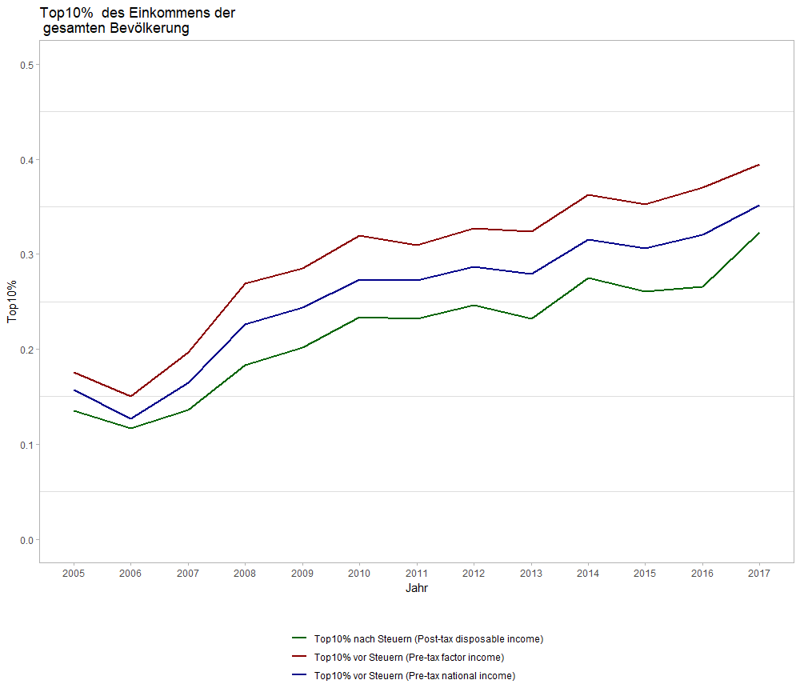

```{r setup, include=FALSE}

library(readr)
library(dplyr)
library(survey)
library(convey)
library(knitr)

```

\newpage

# Einleitung

In dieser Seminararbeit soll die Einkommensverteilung in Österreich genauer untersucht werden. Besonders in letzter Zeit sind Fragen der Verteilung von Einkommen und Vermögen immer stärker in den öffentlichen Diskurs gerückt und haben dementsprechend auch stärkeren Einfluss auf den wirtschaftlichen Bereich entwickelt. Hierbei schwächt eine ungleiche Verteilung dem Trade and Development Report 2012 der United Nations Conference on Trade and Development (UNCTAD) zufolge das Entwicklungspotenzial einer Volkswirtschaft aufgrund einer geringeren Nachfrage nach Gütern und Dienstleistungen.
Des Weiteren sind diesem Bericht zufolge Bildungschancen und soziale Mobilität hierdurch eingeschränkt. Nichtsdestotrotz hat sich die Ungleichheit seit den 1980er Jahren laut UNCTAD sowohl zwischen armen und reichen Ländern, als auch innerhalb einer Großzahl an Ländern verstärkt.

Infolge der Panama-Papers und anderen Enthüllungen sind besonders Themen wie die Vermeidung von Steuern über sogenannte Steueroasen, aber auch die ungleichmäßige Verteilung von Vermögen und Einkommen und die damit einhergehende Polarisierung von Einkommen und deren Ungleichheit an Relevanz gewonnen. Diese Seminararbeit setzt sich daher das Ziel in Form einer Aufstellung der wichtigsten Ungleichheitsindikatoren einen Beitrag zum öffentlichen Diskurs in Österreich zu leisten. Wir untersuchen daher verschiedene Einkommenskonzepte und Indikatoren auf Basis des EU-SILC Datensatzes für Österreich. Durch die Verwendung von Indikatoren und geläufigen Einkommenskonzepten soll eine gewisse Vergleichbarkeit mit anderen (EU-) Ländern möglich gemacht werden. 

Eine ähnliche Analyse für Österreich wurde 2007 von Guger und Marterbauer durchgeführt. Diese beschäftigen sich in einer Studie des Österreichischen Instituts für Wirtschaftsforschung mit der langfristigen Entwicklung der Verteilung von Einkommen.  Die Autoren kommen zu dem Schluss, dass sich die ohnehin schon große Einkommensschere in den letzten Jahrzehnten weiter vergrößert hat. Sie führen diesen Trend unter anderem auf einen Anstieg der Arbeitslosigkeit sowie auf die Flexibilisierung des Arbeitsmarktes, e.g. Ausweitung der Teilzeitarbeit, zurück. Diese beiden Faktoren zeichnen sich auch für die großen geschlechtlichen Unterschiede bei Einkommen verantwortlich. 

@agendaaustria2015 kommen zu einer weniger düsteren Conclusio. Sie argumentieren, dass sich der Gini-Koeffizient des äquivalisierten Haushaltseinkommens in Österreich (vor und nach Sozialleistungen) in den letzten zwei Jahrzehnten nur unwesentlich verändert hat. Im EU-Vergleich weise Österreich daher eine relativ gleiche Verteilung von Einkommen aus. Eine Umverteilungsdebatte sei verzerrt, da sich die Trends durch veränderte Strukturen innerhalb der Bevölkerung erklären lassen. In diesem Sinn wird wie folgt argumentiert: “Nicht habgierige Arbeitgeber oder die Konkurrenz unter den Arbeitnehmern sorgen gegebenenfalls für mehr Ungleichheit in der Einkommensverteilung, sondern Demografie, Zuwanderung, Bildungsstand, kleinere Haushaltsgrößen und der Wunsch nach Teilzeitbeschäftigung.” (Christl et al., 2005)

@humer2013bedeutung zufolge ermöglichen Haushaltserhebungen wie der EU-SILC und der HFCS eine umfassendere Analyse als nur administrative Datensätze, da hierbei Einkommensdaten um Vermögenseinkommen erweitert werden können. Ein Problem von Haushaltserhebungen sei jedoch die Untererfassung an den Rändern der Verteilung. Sie finden für den Großteil der Bevölkerung einen nur sehr kleinen Einfluss von Vermögenseinkünften als Zuverdienst zur Erwerbstätigkeit. Ein Lebensunterhalt durch Vermögenseinkünfte sei daher nur für die obersten Perzentile möglich [@humer2013bedeutung]. 

Verweibe und Fritsch (2011) untersuchen die Armut von Erwerbstätigen in Europa. Ihnen zufolge ist es für einen immer größer werdenden Teil der arbeitenden österreichischen Bevölkerung nicht mehr möglich durch ein Normalarbeitsverhältnis ein Leben außerhalb der Armut zu führen. In diesem Zusammenhang entdecken sie einen Anstieg der sozialen Ungleichheit. Das Phänomen des “working poor” wird mithilfe der EU-SILC Daten und dem dazugehörigen Bruttoeinkommen untersucht.

In den Jahren 2015 und 2016 wurde in Österreich eine Steuerreform durchgeführt. Im Durchschnitt soll die Entlastung des verfügbaren äquivalisierten Haushaltseinkommens um 829€ (3,3%) ansteigen. In dieser Analyse des Budgetdienstes des Parlaments (Juni 2015) wird darauf hingewiesen, dass rund 52,6% des Entlastungsvolumens auf die oberen drei Dezile entfallen. Auf den ersten Blick scheint diese Reform dem Ziel einer gerechteren Verteilung entgegenzuwirken. Es wird jedoch darauf hingewiesen, dass Haushalte in den oberen Dezilen (voraussichtlich) stärker von den Gegenfinanzierungsmaßnahmen betroffen seien. Des Weiteren scheint es als ob Männer aufgrund des unterschiedlichen Erwerbsverhaltens wesentlich stärker von der Steuerentlastung profitieren würden als Frauen. 

Der weitere Text gliedert sich wie folgt: In Sektion Zwei werden Datenauswahl, die ausgewählten Einkommenskonzepte sowie Indikatoren erläutert. Sektion Drei stellt die Ergebnisse vor, die wichtigsten Erkenntnisse werden in Sektion Vier nochmals wiederholt und besprochen.

\newpage

#Daten und Methodologie

Als Grundlage dieser Seminararbeiten dienen Daten einer Erhebung der Europäischen Union: die European Union Statistics on Income and Living Conditions  (EU-SILC;  Gemeinschaftsstatistik über Einkommen und Lebensbedingungen). Seit 2005 erfasst das Europäische Statistische System Daten zu  Einkommen, Armut, soziale Ausgrenzung und Lebensbedingungen. In einigen Ländern reicht die Zeitspanne der Erhebung weiter zurück (e.g. österreichische Daten können auch bereits für das Jahr 2003 eingesehen werden). Dabei werden zwei verschiedene Arten von Daten erhoben: Es handelt sich dabei einerseits um Querschnittsdaten über einen bestimmten Zeitpunkt, andererseits Längsschnittdaten welche Veränderungen auf individueller Ebene über einen gewissen Zeitraum beobachten (Europäische Union). 
Die Längsschnittdaten dienen zur Identifizierung gewisser Ereignisse und Prozesse bezüglich der Existenz von Armut und sozialer Exklusion der Bevölkerung. Generell umfassen die EU-SILC daten 4 verschiedene Arten von Daten: 
 
(i) Variablen gemessen auf Haushaltsebene;
(ii) Informationen über Haushaltsgröße, Zusammenstellung und Grundmerkmale der Haushaltsmitglieder;
(iii) Einkommen und andere, komplexere, variablen die als “basic variables” bezeichnet werden und auf der persönlichen Ebene gemessen werden und normalerweise aggregiert werden um Variablen auf Haushalts-level konstruieren zu können; und 
(iv) Variablen die auf persönlicher Ebene gesammelt und analysiert werden, sogenannte “detailed variables” (GESIS).


##Variablen
Da es in dieser Seminararbeit die Einkommensverteilung in Österreich untersucht werden soll wurden die EU-SILC Daten für Österreich herangezogen. Des Weiteren wurden diese dementsprechend selektiert um das Ziel bestmöglich beschreiben zu können. aus den Datensätzen wurden die folgenden variablen herangezogen:

(i) Household Register: db010, db020, db030, db040, db090
(ii) Household Data: hb010, hb020, hb030, hy010, hy020, hy030g, hy040g, hy050g, hy060g, hy070g, hy080g, hy090g, hy110g, hy120g, hy130g, hy140g, hx040, hx050
(iii) Personal Register: rb010, rb020, rb030, rb050, rb080, rb090, rx010, rx030
(iv) Personal Data: pb010, pb020, pb030, pb040, pb150, py010g, py020g, py050g, py050n, 
         py080g, py090g, py100g, py110g, py120g, px010,px030, py130g, py140g

Genauere Beschreibungen dieser Daten werden von GESIS angeboten und sind unter der  Homepage https://www.gesis.org/en/missy/metadata/EU-SILC/ verfügbar. 
Die Daten wurden im Anschluss mit Hilfe der Programmiersprache R eingelesen und bearbeitet um in Folge die gewünschten Analysen durchführen zu können. 
Unter anderem werden in dieser Analyse folgende Indikatoren für Österreich berechnet:   

**Mittelwert**: Der Durschnittliche Wert aller Einkommen.      
**Median**: Der sich in der Mitte befindende Wert aller Einkommen.  
**Gini**: Der Gini-Index dient zur Messung, inwieweit die Einkommensverteilung (oder in einigen Fällen die Konsumausgaben) zwischen Einzelpersonen, oder Haushalten innerhalb einer Volkswirtschaft, von einer vollkommen gleichen Verteilung abweicht. Dabei misst er den Bereich zwischen der Lorenz-Kurve und einer hypothetischen Linie der absoluten Gleichheit, ausgedrückt als Prozentsatz der maximalen Fläche unter der Linie. Dabei ist anzumerken, dass ein Gini von 0 perfekte Gleichheit darstellt, wohingegen ein Wert von 1 perfekte ungleichheit signalisiert (OECD).    
**20/80 Share Ratio**: Die Einkommensquintilanteilsquote oder die S80/S20 Share Ratio ist ein Maß für die Ungleichheit der Einkommensverteilung. Sie wird als Verhältnis des Gesamteinkommens der 20% der Bevölkerung mit dem höchsten Einkommen (dem obersten Quintil) zu dem Einkommen der 20% der Bevölkerung mit dem niedrigsten Einkommen (dem unteren Quintil) berechnet.   
**Top 10% Income Share**: Anteil des Einkommens das von den zehn höchsten Prozent gehalten wird.   

##Einkommens-Versionen

Die Ergebnisse jeder empirischen untersuchung wird durch die Wahl der untersuchten Indikatoren abhängig (Kitterer). In dem Fall der Einkommensverteilung in Österreich ist es daher wichtig,  die richtige Basis, also die passenden Einkommenskonzepte zu finden und zu definieren. Sollte dies nicht geschehen sind zum Teil gravierende Unterschiede zu befürchten. Es könnte beispielsweise der Gini-Index variieren. Diese Variation kann prozentuale Änderungen von bis zu 30% zur Folge haben (Kitterer). Darüber hinaus ist es wichtig, einheitliche, international vergleichbare Einkommenskonzepte zu definieren und zu verwenden. Nur durch dieses gezielte und akribische Vorgehen wird es möglich, über nationale Grenzen hinweg vergleichbare Werte und Indikatoren zu berechnen. 

Generell ist es möglich zwischen Haushaltseinkommen und persönlichem Einkommen zu unterscheiden. Laut Canberra Group besteht Haushaltseinkommen aus allen Bezügen, monetär oder anderer Art, die von einem Haushalt oder von Individuen dieses Haushaltes in regelmäßigen Abständen erhalten werden (Canberra Group). Darüber hinaus gibt es das persönliche Einkommen welches durch die Individuen kreiert wird und daher auch einen Teil des Haushaltseinkommens bildet. 

In der im Zuge dieser Seminararbeit durchgeführten Analyse  wurden folgende Einkommenskonzepte, bestehend aus den unten angegebenen Variablen der EU-SILC Daten, herangezogen und berechnet: 

###1. Pre-tax factor income (Canberra: primary income)
Summe aus:
(1) Einkommen aus Arbeit (inkl. Selbstständige): gross employee cash or near cash income (py010g), company car (py021g), gross cash benefits or losses from self-employment (including royalties) (py050g), income received by people aged under 16 (hy110g).
(2) Vermögenseinkommen: income from rental of a property or land (hy040g), interests, dividends, profit from capital investments in unincorporated business (hy090g), pensions received from individual private plans (py080g).
 
###2. Pre-tax national income: 
Summe aus:
(1), (2), (3) Pensionen und Arbeitslosengeld: unemployment benefits (py090g), old-age benefits (py100g).
 
###3. Post-tax disposable income:
Summe aus:
(1), (2), (3), (4) Alle anderen erhaltenen Transferzahlungen: survivor' benefits (py110g), sickness benefits (py120g), disability benefits (py130g), education-related allowances (py140g), family/children related allowances (hy050g), social exclusion not elsewhere classified (hy060g), housing allowances (hy070g), regular inter-household cash transfers received (hy080g); abzüglich (5) alle steuern und sozialversicherungsabgaben:regular taxes on wealth (hy120g), regular inter-household cash transfer paid (hy130g), tax on income and social insurance contributions (hy140g).
Diese verschiedenen Einkommensaggregate werden in weiterer Folge durch verschiedene Grundgesamtheiten berechnet. Einerseits werden alle Individuen zur Berechnung hergenommen, und die Einkommen auf alle Individuen aufgeteilt. Andererseits werden die oben angeführten Einkommensaggregate nur für jene Personen berechnet, die zum Zeitpunkt der Befragung das 20. Lebensjahr begonnen haben. 

\newpage

#Ergebnisse

Im folgenden werden die oben genannten Indikatoren für alle Formen des Einkommens, sowie Anhand der Unterscheidung zwischen den Grundgesamtheiten (Gesamte Bevölkerung sowie Personen über 20 Jahre) berechnet und aufgezeigt werden.    

##Grundgesamtheit 1: Gesamte Bevölerkung

###Table 1: Pre-tax factor income

```{r echo=FALSE}
kable(readRDS("./reports/AUT/tables/_tables_AUT_p1_1.rds"))
```

Betrachtet man das factorale Einkommen der gesamten Bevölkerung vor der Versteuerung so lässt sich auf den ersten Blick fesstellen, dass sowohl Mittelwert als auch Median stark gestiegen sind. Darüber hinaus kann man beobachten, dass der Gini, also das Maß für ungleichheit, sich konstant zwischen den Werten 0.43 und 0.49 bewegt. Daher kann man behaupten, dass das Einkommen aus Arbeit und Vermögen einer ungleichmäßigen Verteilung folgt. Dies zeigt sich auch durch den hohen Anteil des Einkommens der durch die höchsten 10% verdient wird. Interessant ist es auch zu beobachten wie sich dieser Anteil in den letzten Jahren entwickelt hat. Dabei gab es einen Ansteig von 17% im Jahr 2005 auf beinahe 40% im Jahr 2017. Auch die Einkommensquatilsanteile weisen  einen starken Anstieg auf, zwischenzeitlich sogar bis auf 72.34576. Jedoch sinkt diese Ratio danach wieder; im Jahr 2017 verdienen die am oberen Ende der Einkommen angesiedelten 20% in etwa 36 mal so viel wie jene am unteren Ende. 

###Table 2: Pre-tax national income

```{r echo=FALSE}
kable(readRDS("./reports/AUT/tables/_tables_AUT_p1_2.rds"))
```
 
Inkludiert man sowohl Pension wie auch Arbeitslosengeld, also soziale Transferleistungen, so verändert sich das Bild maßgeblich. Sowohl Mittelwert als auch Median sind höher, genauer gesagt in etwa zwischen 3000 und 5000 höher als in der vorhergeangenen Berechnung. Der Gini-Koeffizient liegt im Jahr 2017 bei 0.35. Dies ist um 0.1 weniger als in der obigen Bemerkung und ist nicht überraschend, da sowohl Arbeitslosengeld wie auch Pensionen dazu beitragen sollten, dass Einkommen gleichmäßiger verteilt sind. Auch die Anteile der oberen im Vergleich zum unteren Ende verhält sich ausgeglichener. Diese bewegt sich zwischen 5.5 und 7.8 und betrug im Jahr 2017 circa 6.9. Somit verdienten die oberen 20% in etwa 7 mal so viel wie jene am unteren Ende. Nicht so stark veränderte sich der Anteil der Top10% am Einkommen. Zwar ist dieses geringer als zuvor, übertrifft aber im Jahr 2017 immer noch 35%. Auch hier hat sich der Wert seit 2005 fast verdoppeln können. 
 
###Table 3: Post-tax disposable income

```{r echo=FALSE}
kable(readRDS("./reports/AUT/tables/_tables_AUT_p1_3.rds"))
```

##Grundgesamtheit 2: Personen über 20 Jahre

###Table 4: Pre-tax factor income (Canberra: primary income)

```{r echo=FALSE}
kable(readRDS("./reports/AUT/tables/_tables_AUT_p2_1.rds"))
```

###Table 5: Pre-tax national income

```{r echo=FALSE}
kable(readRDS("./reports/AUT/tables/_tables_AUT_p2_2.rds"))
``` 
 
###Table 6: Post-tax disposable income

```{r echo=FALSE}
kable(readRDS("./reports/AUT/tables/_tables_AUT_p2_3.rds"))
```


\newpage

##Grafiken zur entwicklung des Gini-Koeffizienten und der Top10% Share Ratio  

###Grundgesamtheit 1: Gesamte Bevölerkung

{width=80%}


{width=80%}

###Grundgesamtheit 2: Personen über 20 Jahre

{width=80%}

{width=80%}

\newpage


# Zusammenfassung

##Ausblick  

Des weiteren sind wir uns noch uneinig welche Spezialisierung wir in unserer Arbeit einbauen werden. Nach derzeitigem Stand wäre es für uns am interessantesten, das Gender-Pay-Gap einzuarbeiten. Jedoch ist sich dies in der derzeitigen Version der Seminararbeit noch nicht möglich und wird im finalen Bericht eingebaut

# Literatur

<!-- Leer lassen -->